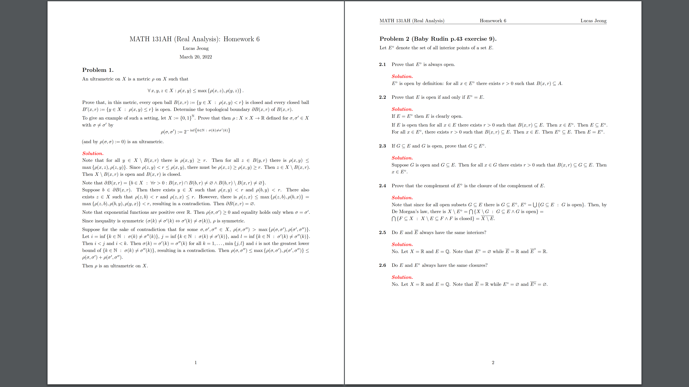

# latex-homework-class

cuz i wanna make my homework look a bit less bland

heavy inspiration from [`jez/latex-homework-class`](https://github.com/jez/latex-homework-class)

## screenshot


## installation
not that i expect anyone to ever find this and think to themselves "wow this is really cool im gonna use this"

anyways, 

to use this globally, copy `homework.cls` to directory `$TEXMFHOME/tex/latex`

to find `$TEXMFHOME`, run the command
```sh
kpsewhich -var-value=TEXMFHOME
```

to use this in a single latex project, copy `homework.cls` to the project directory

see [this](https://tex.stackexchange.com/questions/1137/where-do-i-place-my-own-sty-or-cls-files-to-make-them-available-to-all-my-te) for extra help

## usage

see [`homework.tex`](homework.tex) for a brief overview of the usage

### basic information
use `\class{<classname>}` to edit the name of the class, 
use `\type{<type>}` to edit the type of the assignment ("Homework" by default), 
use `\num{<number>}` to edit the assignment number, and 
use `\name{<name>}` to edit the name to be displayed

the visibility of each of these is not optional... yet

### `\problem`
use `\problem` to indicate the beginning of the statement of a new problem

pass in an optional argument `\problem[<problem name / description>]` to make a problem named

to typeset subproblems, follow this structure: 
```tex
\begin{subproblems}
  \subproblem <description>

  \subproblem <description>
\end{subproblems}
```

the labeling for problems are in arabic numerals and that for subproblems are in lower case alphabet by default
to change these, use `\problemLabelStyle{<style>}` and `\subproblemLabelStyle{<style>}` where `<style>` is any of 
- `arabic`, 
- `roman`, 
- `Roman`, 
- `alph`, 
- `Alph`, and 
- `fnsymbol` (footnote symbol, but like why??? would you use this)

### `\solution`
use `\solution` to indicate the beginning of your solution to a problem

optionally use `\solutionColor{<color>}` to highlight the `\solution` (i use red)